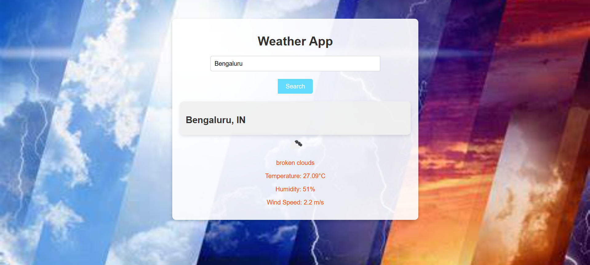
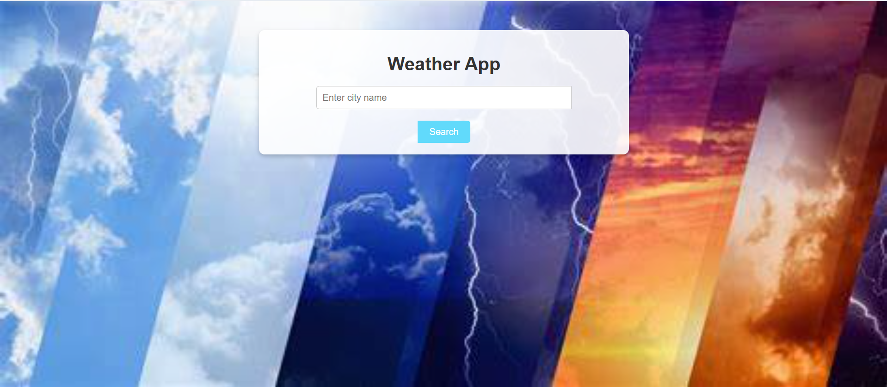

# Weather App 🌦️

A simple React-based weather application that fetches current weather data using the OpenWeatherMap API.

## 🔧 Tech Stack
- React.js
- Fetch API
- HTML/CSS

## ✨ Features
- Search weather by city name
- Displays temperature, humidity, condition, and weather icon
- Handles invalid city names with error messages
- Fully responsive and clean user interface

## 🔗 Live Demo
👉 [myreactchirag-weatherapp.netlify.app](https://myreactchirag-weatherapp.netlify.app)

## 📸 Screenshot
<!-- You can upload a screenshot here later -->

## 📁 Folder Structure
- `App.js` – Handles search input, API calls, and state
- `WeatherCard.js` – Reusable component to display weather info

## 📬 Contact
**H M Chirag**  
📧 chiragshettyhm@gmail.com  
📍 Bengaluru, India
